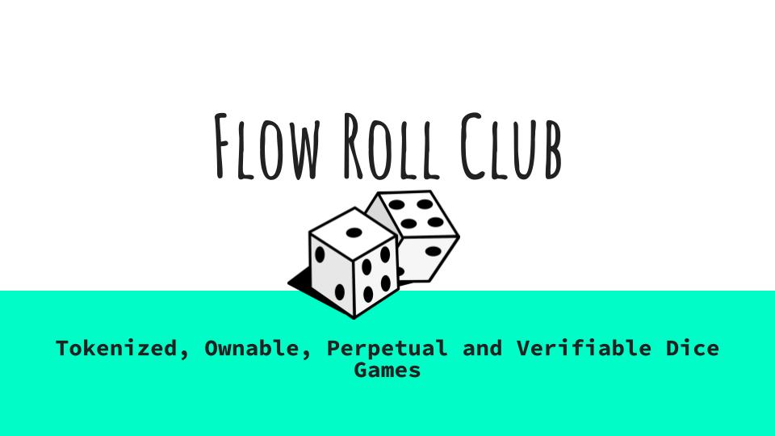

# Flow Roll Club Front End

This is the front end for Flow Roll Club. A gambling Dice NFT project built exclusively for Flow network

Visit [Flow Roll Club website](https://flowroll.club)

Flow Roll Club allows players to mint their own games and bet on dice rolls. The games are ownable and can be traded, with the fees accumulating to the owner's balance. 

The game follows a bet -> roll game play where there are two blockchain transactions to place a bet and then reveal the result.

Following the Flow Forte upgrade the game has been simplified with scheduled transactions, so the bet schedules the future roll,no need to call 2 functions.

Flow Roll Club contains  2 main pages, [Mint](https://flowroll.club/mint) and [Games](https://flowroll.club/games).

## Mint Page
The mint page lets a minter specify:
1. The name of the game
2. Game minting costs Flow. But a coupon code can be used to reduce the fee. FlowRoll.club contains an innovative coupon system and anyone can get one. Just reach out to get one. You can earn commission from the users of your coupon!
3. The token address to play with. Must be ERC20 compatible.
4. Winner prize share, is the amount of the prize pool the winner will get.
5. Fixed Bet Amount is the amount it costs to make a bet
6. House edge is the percentage of fees that go to the NFT owner
7. Bet min is the minimum number that is rolled
8. Bet max is the maximum number that is rolled
9.  Bet type specifies if the player needs to make an exact guess or roll a number divisible by a divider.

When making an exact guess the player specifies which number they think is the winner. E.G: If min is 1 max is 6 and the player bets on 4 then the next roll must be a 4 to win.

When the winning number must be divisible by a divider, that specifies which numbers are winners. E.G: min is 1, max is 6, winner is divisible by 2, then the winning numbers are 2,4,6

## Games Page

The games page lets a player select a game by minted index. These are NFT ids. The games are indexed from zero.

## Game Page
When navigating to a game page, the link is like https://flowroll.club/games/0

The games are designed to be linked and shared on x.com

The page contains all the details of the game.
It allows topping up the prize pool, so there is incentive for the players to participate
Then the players can place bets and after bets are placed rolls can be made.

# Wallet
The game uses the Flow FCL.js wallet selector and it's compatible with every wallet that supports it!